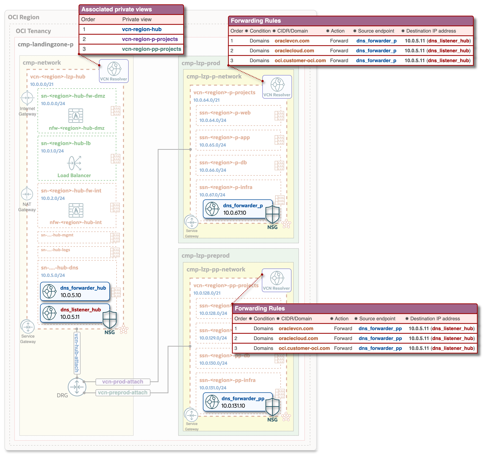

# **[OCI Private DNS deployment guide](#)**
## **An OCI Open LZ [Addon](#) to Tailor and Optimize Your DNS configuration**

&nbsp; 

**Table of Contents**

- [Overview](#Overview) 

&nbsp;

## **Overview**
This guide provides the steps for the configuration and deployment of Private DNS on top of existing/already deployed Hub & Spoke architecture with the chosen [Hub model](https://github.com/oci-landing-zones/oci-landing-zone-operating-entities/blob/master/addons/oci-hub-models/readme.md), it will deploy the highlighted components in the below architecture diagram. In this guide Hub A model 

---

The DNS configuration consist of the following objects - to be added and adjusted:

**Configuration objects for Hub VCN:**

- **1st object**: NSG (Network Security Group) configuration, which then is attached to the HUB DNS Listener. This allows required Ingress and Egress traffic for DNS communication with Spoke DNS Forwarders.

                            "NSG-FRA-LZP-HUB-DNS-KEY": {
                                "display_name": "nsg-fra-lzp-hub-dns",
                                "egress_rules": {
                                    "egress_dns_prod_udp": {
                                        "description": "Egress to Prod DNS endpoint: UDP, Stateless",
                                        "src_port_max": 53,
                                        "src_port_min": 53,
                                        "dst": "10.0.67.10/32",
                                        "dst_type": "CIDR_BLOCK",
                                        "protocol": "UDP",
                                        "stateless": true
                                        ...
                            }

- **2nd object**: Associated Private views, Forwarder and Listener configuration in Hub VCN. OCIDs of the dns views should be gathered from OCI console or CLI, once VCNs are deployed.

                        "dns_resolver": {
                            "display_name": "vcn-fra-lzp-hub",
                            "attached_views": {
                            "DNS-HUB": {
                                "existing_view_id": "ocid1.dnsview.oc1..." 
                                },
                            "DNS-P-PROJECTS": {
                                "existing_view_id": "ocid1.dnsview.oc1..." 
                                },
                            "DNS-PP-PROJECTS": {
                                "existing_view_id": "ocid1.dnsview.oc1..." 
                                }
                            },
                            "resolver_endpoints": {
                                "RESOLVER_HUB_ENDPOINT_FORWARDER_1": {
                                    "enpoint_type"      : "VNIC",
                                    "is_forwarding"     : "true",
                                    "is_listening"      : "false",
                                    "forwarding_address": "10.0.5.10",
                                    "name"              : "dns_forwarder_fra_hub",
                                    "subnet"            : "SN-FRA-LZP-HUB-DNS",
                                    "nsg"               : null
                                    },
                                "RESOLVER_HUB_ENDPOINT_LISTENER_1" : {
                                    "enpoint_type"     : "VNIC",
                                    "is_forwarding"    : "false",
                                    "is_listening"     : "true",
                                    "listening_address": "10.0.5.11",
                                    "name"             : "dns_listener_fra_hub",
                                    "subnet"           : "SN-FRA-LZP-HUB-DNS",
                                    "nsg"              : ["NSG-FRA-LZP-HUB-DNS-KEY"]
                                }
                            }
                        }

---

**Configuration objects for Spoke VCNs (Prod and PreProd):**

- **1st object**: NSG configuration, which then is attached to the Prod DNS Forwarder. This allows required Ingress and Egress traffic for DNS communication with Hub DNS Listener.

                            "NSG-LZP-P-PROJECTS-DNS-KEY": {
                                "display_name": "nsg-lzp-p-projects-dns",
                                "egress_rules": {
                                    "egress_dns_udp": {
                                        "description": "Egress to Hub DNS endpoint: UDP, Stateless",
                                        "dst_port_max": 53,
                                        "dst_port_min": 53,
                                        "dst": "10.0.5.11/32",
                                        "dst_type": "CIDR_BLOCK",
                                        "protocol": "UDP",
                                        "stateless": true
                                        ...
                            }

- **2nd object**: DNS resolver configuration for Forwarder and Forwarding Rules. 

                        "dns_resolver": {
                            "display_name": "vcn-fra-lzp-p-projects",
                            "attached_views": {},
                            "rules" : [
                                {
                                "action"                : "FORWARD",
                                "destination_address"   : ["10.0.5.11"],
                                "source_endpoint_name"  : "RESOLVER_P_ENDPOINT_FORWARDER_1",
                                "qname_cover_conditions": ["oraclevcn.com"]
                                },
                                {
                                "action"                : "FORWARD",
                                "destination_address"   : ["10.0.5.11"],
                                "source_endpoint_name"  : "RESOLVER_P_ENDPOINT_FORWARDER_1",
                                "qname_cover_conditions": ["oraclecloud.com"]
                                },
                                {
                                "action"                : "FORWARD",
                                "destination_address"   : ["10.0.5.11"],
                                "source_endpoint_name"  : "RESOLVER_P_ENDPOINT_FORWARDER_1",
                                "qname_cover_conditions": ["oci.customer-oci.com"]
                                }
                              ],
                            "resolver_endpoints": {
                                "RESOLVER_P_ENDPOINT_FORWARDER_1": {
                                    "enpoint_type"      : "VNIC",
                                    "is_forwarding"     : "true",
                                    "is_listening"      : "false",
                                    "forwarding_address": "10.0.67.10",
                                    "name"              : "dns_forwarder_fra_p",
                                    "subnet"            : "SSN-FRA-LZP-P-INFRA",
                                    "nsg"               : ["NSG-LZP-P-PROJECTS-DNS-KEY"]
                                }
                            }
                        }

The same configuration applies for Prod and Pre-Prod, with only difference that a respective IP address should be defined for each Spoke DNS Forwarder. 

---

&nbsp; 

#### License
Copyright (c) 2025 Oracle and/or its affiliates.

Licensed under the Universal Permissive License (UPL), Version 1.0.

See [LICENSE](/LICENSE.txt) for more details.
