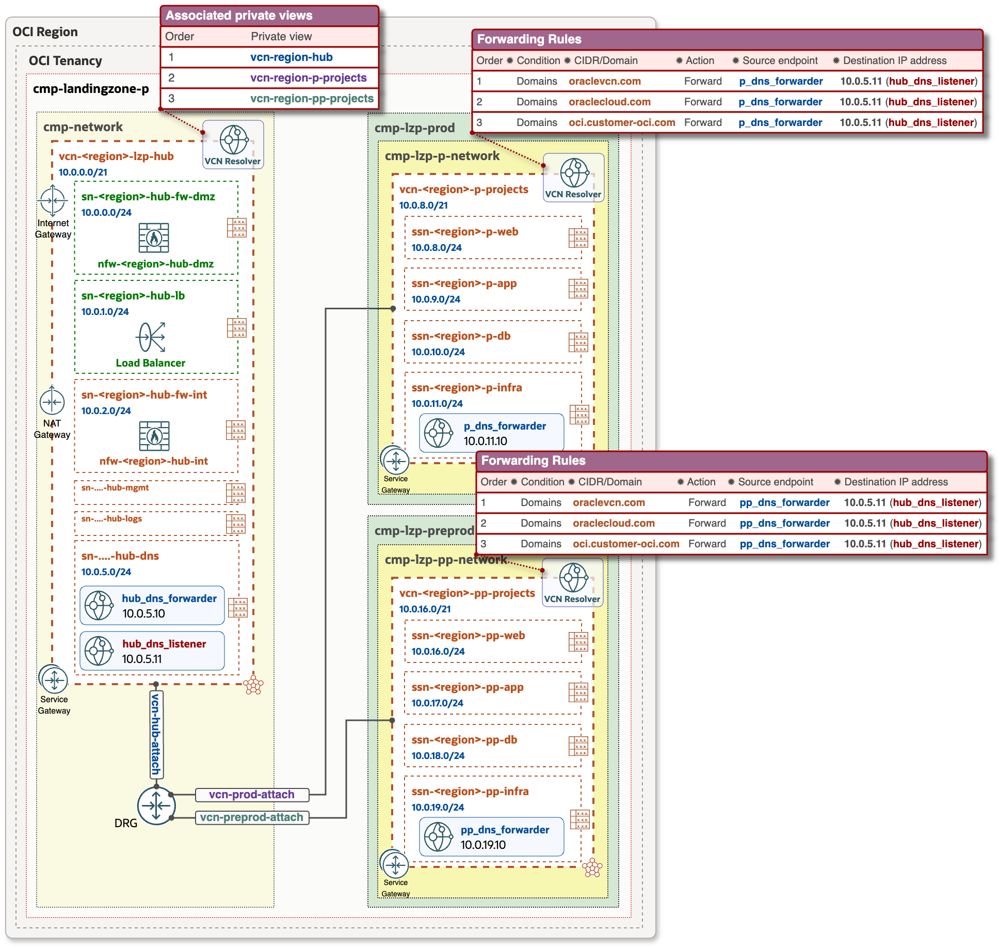

# OCI Private DNS configuration for Hub & Spoke

&nbsp; 

### Overview
This configuration enables centralized management of private DNS zones within a Hub VCN, controlled by a central network team. All DNS configurations, including zone creation and record updates, are streamlined through a single management plane. This ensures consistency, simplifies administration and eliminates the complexity of managing DNS across multiple environments and OCI regions.

&nbsp;

This document comprises configuration views for multiple use cases:
1. Private DNS configuration view for Hub & Spoke architecture in One Region.
2. Private DNS configuration view for Multi Regions, where Hub & Spoke VCNs are peered via Remote Peering Connection (RPC).

&nbsp;

### OCI Private DNS resources

| Resource | Description |
| - | - |
| VCN Resolver | A VCN dedicated private DNS resolver contains the configuration that serves responses to DNS queries within the VCN. The resolver listens on 169.254.169.254 by default. |
| Private Zones | Private zones contain DNS data only accessible from within a VCN, such as private IP addresses. |
| Private Views | A private DNS view is a collection of private zones, and these are: • **Default Private View** - a dedicated/default view for VCN Resolver. • **Associated Private Views** - the private views from other VCNs, added into VCN Resolver. |
| Resolver Endpoints | There are two types of endpoints: • **Listening endpoint** - allows the DNS Resolver to answer DNS queries coming from outside the VCN, such as on-prem systems and other resolvers. • **Forwarding endpoint** - allows the DNS resolver to query a remote DNS as defined in the Forwarding rules. |
| Forwarding Rules | Rules are used to answer queries that aren't answered by a resolver's views and the queries that match the rule condition will be handled by the rule. If no rules match, the query will be resolved from internet DNS. |

&nbsp;

### VCN Resolver order 
DNS responses by VCN Resolver are processed based on the below presented order:
&nbsp;

&nbsp;

### 1. One Region: Private DNS configuration view
&nbsp;
Configuration details:
  - Hub VCN consist of the following resources and components: 
    - Forwarding (**hub_dns_forwarder**) and Listening (**hub_dns_listener**) endpoints.
    - VCN Resolver has associated private views for Hub and Spokes VCNs, so it contains all DNS data/records of all three VCNs and can resolve any FQDN inside Hub and Spoke architecture.
  - Spoke VCNs have Forwarding (**p_dns_forwarder** and **pp_dns_forwarder** accordingly) endpoints, and conditional forwarding rules, which forwards **oraclevcn.com** domain specific queries to the **hub_dns_listener**.

### Private DNS animation for One Region
This animation illustrates the DNS query and response within Hub & Spoke, and covers the following actions:
- VM (**web01-p**) in prod Spoke VCN performs nslookup to get IP address of VM (**web02-pp**) located in the preprod Spoke VCN.
- Prod VCN resolver chooses **'Forwarding Rules'** as a next action - 3rd item in **VCN resolver order** [VCN resolver order](#VCN-resolver-order).
- Then DNS query is forwarded by **p_dns_forwarder** in prod Spoke VCN to a **hub_dns_listener** endpoint, and then DNS query is passed to the Hub VCN Resolver.
- Hub VCN Resolver has all the DNS data/records from all the **Associated private views**, and it responds back (DNS response) to the prod VM. 

### 2. Multi Region: Private DNS configuration view
&nbsp;

