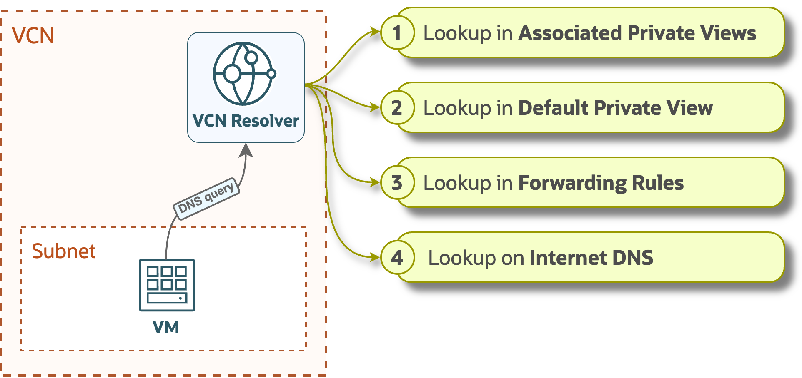
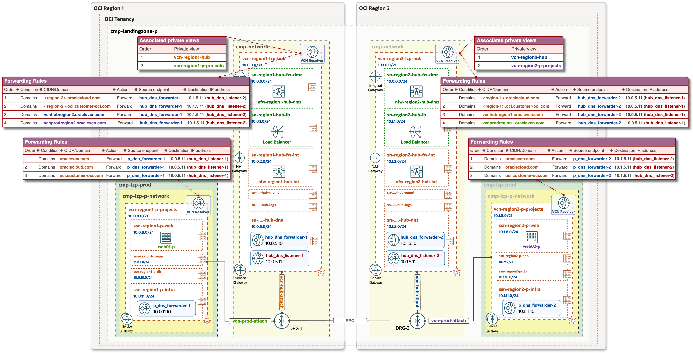

# **[OCI Private DNS configuration](#)**
## **An OCI Open LZ [Addon](#) to Tailor and Optimize Your DNS configuration**

&nbsp; 

### Overview
This configuration enables centralized management of private DNS zones within a Hub VCN, controlled by a central network team. All DNS configurations, including zone creation and record updates, are streamlined through a single management plane. This ensures consistency, simplifies administration and eliminates the complexity of managing DNS across multiple environments and OCI regions.

&nbsp;

This document comprises configuration views for multiple use cases:
1. Private DNS configuration view and animation for Hub & Spoke architecture in One Region.
2. Private DNS configuration view and animation for Multi Region, where Hub & Spoke VCNs are peered via Remote Peering Connection (RPC).

&nbsp;

### OCI Private DNS resources

| Resource | Description |
| - | - |
| VCN Resolver | A VCN dedicated private DNS resolver contains the configuration that serves responses to DNS queries within the VCN. The resolver listens on 169.254.169.254 by default. |
| Private Zones | Private zones contain DNS data only accessible from within a VCN, such as private IP addresses. |
| Private Views | A private DNS view is a collection of private zones, and these are: • **Default Private View** - a dedicated/default view for VCN Resolver. • **Associated Private Views** - the private views from other VCNs, added into VCN Resolver. |
| Resolver Endpoints | There are two types of endpoints: • **Listening endpoint** - allows the DNS Resolver to answer DNS queries coming from outside the VCN, such as on-prem systems and other resolvers. • **Forwarding endpoint** - allows the DNS resolver to query a remote DNS as defined in the Forwarding rules. |
| Forwarding Rules | Rules are used to answer queries that aren't answered by a resolver's views and the queries that match the rule condition will be handled by the rule. If no rules match, the query will be resolved from internet DNS. |

&nbsp;

### VCN Resolver order 
DNS responses by VCN Resolver are processed based on the below presented order:
&nbsp;

&nbsp;

### 1. One Region: Private DNS configuration view
&nbsp;
Configuration details:
  - Hub VCN consist of the following resources and components: 
    - Forwarding (**hub_dns_forwarder**) and Listening (**hub_dns_listener**) endpoints.
    - VCN Resolver has associated private views for Hub and Spokes VCNs, so it contains all DNS data/records of all three VCNs and can resolve any FQDN inside Hub and Spoke architecture.
  - Spoke VCNs have Forwarding (**p_dns_forwarder** and **pp_dns_forwarder** accordingly) endpoints, and conditional forwarding rules, which forwards **oraclevcn.com** domain specific queries to the **hub_dns_listener**.

---

### Private DNS animation for One Region

These animations illustrate the DNS query and response within Hub & Spoke, and covers the following scenarios:

1. **DNS resolution within the same Spoke VCN**
- **web01-p.ssnpweb.vcnprod.oraclevcn.com** in prod Spoke VCN performs nslookup to retrieve an IP address of the **db01-p.ssnpdb.vcnprod.oraclevcn.com** database instance located in th same Spoke VCN, but in the different subnet.
- Prod VCN resolver evaluates the items in the [VCN resolver order](#VCN-resolver-order) list, with the following order: 
   •1• Associated Private Views: as there is no Private views association with Prod VCN resolver, it checks the next one. 
   •2• Default Private View: in this case Default private View contains a DNS record for the database.
- Prod VCN resolver sends back DNS response to the **web01-p**.
- After an answer is provided, no further items are evaluated, even if the answer is negative.

&nbsp;

2. **Spoke to Spoke DNS resolution:**
- **web01-p.ssnpweb.vcnprod.oraclevcn.com** in prod Spoke VCN performs nslookup to get an IP address of the **web02-pp.ssnppweb.vcnpreprod.oraclevcn.com** located in the preprod Spoke VCN.
- Prod VCN resolver evaluates the items in the [VCN resolver order](#VCN-resolver-order) list, with the following order: 
   •1• Associated Private Views: as there is no Private views association with Prod VCN resolver, it checks the next one. 
   •2• Default Private View: here it contains only self VCN specific DNS records, and prod VCN resolver hasn't DNS record of web02-pp, hence to the next one. 
   •3• Forwarding Rules: it picks this one, as it contains rule for oraclevcn.com forwarding to the **hub_dns_listener**. 
- The DNS query is then forwarded by the **p_dns_forwarder** in the prod Spoke VCN to the **hub_dns_listener** endpoint, and then to the Hub VCN Resolver. 
- Hub VCN Resolver has all the DNS data/records from all the **Associated private views**, and it responds back (DNS response) to the Prod VM **web01-p**.
- After an answer is provided, no further items are evaluated, even if the answer is negative.

Summary: With this configuration inside Hub & Spoke architecture model, all VCN internal and Internet specific DNS queries will be handled by VCN specific resolver, and the domains which are defined and included in the Forwarding rules will be handled by the Hub VCN resolver, those can be external domains as well as private zones created in OCI.

&nbsp;

### 2. Multi Region: Private DNS configuration view
&nbsp;

---

### Private DNS animation for Multi Region
**Spoke to Spoke DNS resolution in different regions:**

- **web01-p.ssnpweb.vcnprodregion1.oraclevcn.com** in Spoke VCN (Region-1) performs nslookup to get an IP address of the **web02-p.ssnpweb.vcnprodregion2.oraclevcn.com** located in Region-2 inside Prod VCN.
- Prod VCN resolver in Region-1 evaluates the items in the [VCN resolver order](#VCN-resolver-order) list, with the following order: 
    •1• Associated Private Views: as there is no Private views association with Prod VCN resolver, it checks the next one. 
    •2• Default Private View: here it contains only self VCN specific DNS records, and prod VCN resolver hasn't DNS record of **web02-p** located in Region-2, hence to the next one. 
    •3• Forwarding Rules: it picks this one, as it contains rule for **oraclevcn.com** forwarding to the **hub_dns_listener-1** through **p_dns_forwarder-1** endpoint. 
- The DNS query is then forwarded by the **p_dns_forwarder-1** in the prod Spoke VCN to the **hub_dns_listener-1** endpoint, and then to the Hub VCN Resolver in Region-1.
- Hub VCN Resolver in Region-1 evaluates the items in the [VCN resolver order](#VCN-resolver-order) list, with the following order: 
    •1• Associated Private Views: those don't contain DNS records for **vcnprodregion2.oraclevcn.com** subdomain, so it checks the next one. 
    •2• Default Private View: here it contains only self VCN specific DNS records, hence to the next one. 
    •3• Forwarding Rules: it picks this one, as it contains rule for **vcnprodregion2.oraclevcn.com** forwarding to the **hub_dns_listener-2** via **hub_dns_forwarder-1** endpoint. 
- The DNS query is then forwarded by the **hub_dns_forwarder-1** in the Hub VCN to the **hub_dns_listener-2** endpoint, and then to the Hub VCN Resolver in Region-2.
- Hub VCN Resolver in Region-2 has the required DNS records from all the **Associated private views**, and it returns (DNS response) the IP address of **web02-p**.
- After an answer is provided, no further items are evaluated, even if the answer is negative.

---

OCI Services such as Autonomous Databases, Oracle Analytics, Streaming, Object Storage, etc, support Private Endpoints, and these services have automatic (publicly resolvable) DNS records in the Oracle owned public zone, such as:
- oraclecloud.com
- oci.customer-oci.com

and when Private Endpoint has been created for these services, that Endpoint gets additional DNS records entry in the Default private view for that specific VCN, in which specific subnet it has been created, to make it possible to resolve and get a private IP address of the endpoint within VCN. 
For simplicity these domains are not depicted inside Forwarding rules in configuration views and animations, but to ensure correct DNS forwarding from Spoke to Hub and/or between regions, those should be included into configuration, as presented in below examples.

Hub VCN resolver Forwarding rules in Region 1, which forwards Region 2 related DNS queries to the Listener in the Region 2: 

Spoke VCN resolver Forwarding rules:
